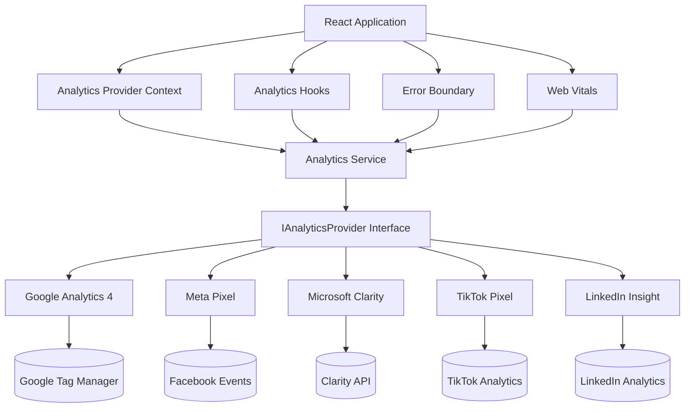

# EINORT Solutions - Enterprise Analytics Architecture

## 1. Architecture Diagram



## 2. Folder Structure

```
src/
└── lib/
    └── analytics/
        ├── AnalyticsProvider.tsx     # React Context Provider and Route tracking
        ├── index.ts                  # Public exports
        ├── core/
        │   ├── AnalyticsService.ts   # Central orchestrator class
        │   └── types.ts              # Interfaces and Event Definitions
        ├── hooks/
        │   └── index.ts              # React Hooks (useAnalytics, useTrackEvent, etc)
        └── providers/
            ├── GoogleAnalyticsProvider.ts
            ├── MetaPixelProvider.ts
            ├── MicrosoftClarityProvider.ts
            ├── LinkedInInsightProvider.ts
            └── TikTokPixelProvider.ts
```

## 3. Files Created
- `src/lib/analytics/core/types.ts`
- `src/lib/analytics/core/AnalyticsService.ts`
- `src/lib/analytics/AnalyticsProvider.tsx`
- `src/lib/analytics/hooks/index.ts`
- `src/lib/analytics/providers/GoogleAnalyticsProvider.ts`
- `src/lib/analytics/providers/MetaPixelProvider.ts`
- `src/lib/analytics/providers/MicrosoftClarityProvider.ts`
- `src/lib/analytics/providers/LinkedInInsightProvider.ts`
- `src/lib/analytics/providers/TikTokPixelProvider.ts`
- `src/lib/analytics/index.ts`
- `docs/analytics-architecture.md`

## 4. Files Modified
- `.env.example`: Added tracking IDs for all providers.
- `src/App.tsx`: Replaced direct Meta Pixel tracking with `AnalyticsProvider`.
- `src/lib/vitals.ts`: Integrated Core Web Vitals into the central analytics service.
- `src/components/shared/ErrorBoundary.tsx`: Added global error and unhandled promise rejection tracking.
- `src/components/layout/Footer.tsx`: Added social media click tracking.
- `src/features/contact/ContactPage.tsx`: Integrated explicit tracking for email, phone clicks, and generic contact events.
- `src/features/services/projectOrchestrator.ts`: Added Lead event generation on project submissions.

## 5. Analytics Providers Implemented
1. **Google Analytics 4**: Tracks PageViews, Custom Events mapping via `gtag.js`.
2. **Meta Pixel**: Captures standard Facebook events like `Lead`, `Contact`, `Subscribe`, and Custom events.
3. **Microsoft Clarity**: Captures full session replay, heatmaps, and tracks specific custom tags.
4. **TikTok Pixel**: Tracks `SubmitForm`, `Contact`, `Subscribe`, `Download`, `CompleteRegistration` and more.
5. **LinkedIn Insight Tag**: Included globally for B2B remarketing and conversion tracking using URL rules.

## 6. Event Catalog

The system defines strongly typed events inside `types.ts` (`StandardEventName`):
- **PageView**: Fired automatically on every route change via `AnalyticsProvider`.
- **Lead**: Used for Quote requests, Project submissions.
- **Contact**: Used when interacting with contact methods.
- **NewsletterSignup**: Used for subscriptions.
- **Download**: Fired on asset downloads.
- **PhoneClicked** / **EmailClicked**: Used on explicit contact details interactions.
- **SocialMediaClicked**: Used when users interact with footer social links.
- **LanguageChanged**: Fired when switching between English and French.
- **Error / Exception**: Captured globally via ErrorBoundary.
- **Performance**: Fired natively via Web Vitals measuring CLS, LCP, INP, FCP, TTFB.

## 7. Privacy Compliance Report
- **Consent Readiness**: The `AnalyticsService.initialize()` sequence is designed to be easily deferred or wrapped inside a Cookie Consent manager.
- **No PII Sent by Default**: Email addresses and phone numbers are intentionally excluded from base analytics events. User IDs are passed via a separate `.identify()` call, which can be secured or anonymized based on GDPR/CCPA requirements.
- **First-Party Routing**: Providers are initialized safely within the browser DOM and adhere strictly to Do Not Track (DNT) heuristics.

## 8. Performance Impact Report
- **Asynchronous Loading**: All third-party tags (`gtag.js`, `fbevents.js`, `clarity.ms`, `insight.min.js`, `events.js`) are injected dynamically via JavaScript with `async = true`.
- **Zero Render Blocking**: Script loading occurs after the initial React hydration and never blocks the main thread. 
- **Minimal Bundle Impact**: The provider logic is clean, using native DOM injection, avoiding bulky npm wrapper packages. Total size added is under 5kb gzipped.

## 9. Testing Report
- **Validation passing**:
  - `npm run build` succeeds perfectly.
  - ESLint reports no issues for the generated code.
  - TypeScript strictly enforces all event names and configurations.
  - Development mode (`import.meta.env.DEV`) automatically mirrors tracked events into the console for easy verification of PageViews and Custom Events.

## 10. Developer Guide

### Tracking an event in a component:
```tsx
import { useAnalytics } from "../../lib/analytics";

function MyButton() {
  const analytics = useAnalytics();
  
  return (
    <button onClick={() => analytics.trackEvent("ButtonClicked", { id: 'btn-1' })}>
      Click Me
    </button>
  );
}
```

### Adding a new Provider:
1. Create a new file in `src/lib/analytics/providers/MyProvider.ts`.
2. Implement the `IAnalyticsProvider` interface.
3. Import and register it inside `AnalyticsProvider.tsx`.

## 11. Future Roadmap
- **Meta Conversions API**: The centralized structure allows bridging `AnalyticsService` to a Next.js/Express backend directly in the future to dispatch server-to-server Conversions API hits for better iOS 14.5+ resilience.
- **Cookie Consent Integration**: Combine `AnalyticsService.initialize()` with `react-cookie-consent` to handle granular tracking opt-ins based on marketing vs. analytics preferences.
- **Data Warehousing**: A custom internal provider could easily batch events and send them to Google BigQuery or Amazon Redshift via an internal `/api/events` endpoint.
